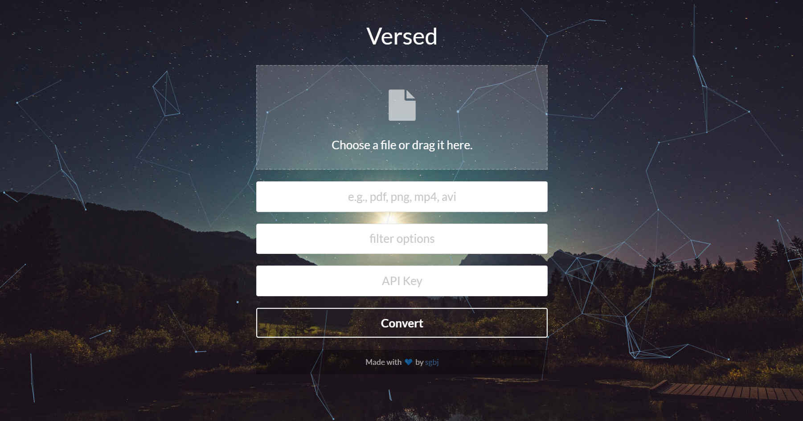

# Versed
File conversion can be a pain. Especially when you're trying to automate it. That's why I created Versed, a microservice specifically for that purpose.

Versed exposes a web API for converting files, and also comes with a simple web frontend for manual file conversion. 





It's currently powered by LibreOffice and FFmpeg, which means it supports the same file formats that those tools support, but you can easily add more tools to its arsenal.

Read the [blog post](http://aka.sb/Versed) to learn more!

## Getting started

Run the following commands to get up and running.

```
git clone https://github.com/sgbj/versed.git
cd versed
docker build -t versed .
docker run -d -e API_KEY=fdhsfjhdsjkghfdjkghfdgiurz -p 3000:3000 versed
```

Open a browser window and go to http://localhost:3000/.

## API Key
The environment variable API_KEY sets the expected API key. Each call must provide exactely this API Key otherwise the conversion is cancelled.

## Filter options
For file types that are converted with libreoffice the filter options allow further control on how the conversion is done.    
E.g the filter option `--infilter=CSV:44,34,UTF8,,,,true` ensures that the text is interpreted as UTF-8 when converting a CSV file. More information on possible filter option can be found here https://wiki.openoffice.org/wiki/Documentation/DevGuide/Spreadsheets/Filter_Options 


## Calling it from Node

One way to consume the convert endpoint in Node.js code is by using the [request package](https://www.npmjs.com/package/request). 

```js
const fs = require('fs');
const request = require('request');

let req = request.post('http://localhost:3000/convert');
let form = req.form();
form.append('file', fs.createReadStream('video.mp4'));
form.append('format', 'gif');
req.pipe(fs.createWriteStream('image.gif'));
```
